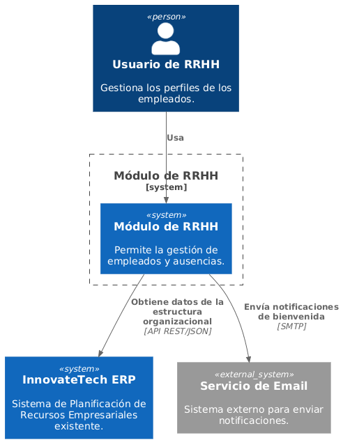

# 3. Alcance y Contexto del Sistema

## Diagrama de Contexto C4

A continuación se muestra el diagrama de contexto para el Módulo de RRHH, que describe cómo interactúa con otros sistemas y actores.

## Descripción del Sistema

El **Módulo de RRHH** permitirá gestionar la información de los empleados (crear, ver, editar, desactivar perfiles) y manejar las solicitudes de ausencias (vacaciones y licencias).

### Sistemas Externos con los que Interactúa

- **InnovateTech ERP**: Sistema existente que contiene la estructura organizacional y los datos de los empleados.
- **Servicio de Email**: Usado para enviar notificaciones a los empleados y gerentes.
