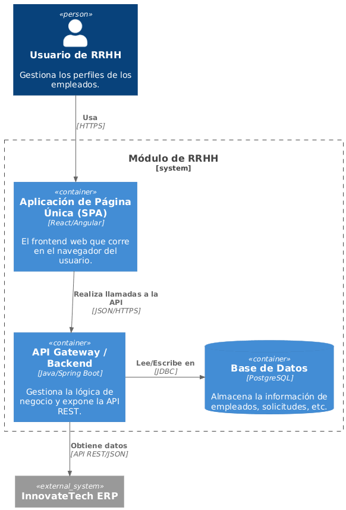

# 5. Vista de Bloques de Construcción

## Diagrama de Contenedores (C4)

A continuación, se muestra el diagrama de contenedores del **Módulo de RRHH**, que describe los principales componentes del sistema.

### Descripción de los Contenedores

- **SPA (Frontend)**: Aplicación de una sola página (React/Angular) que permite la interacción con el sistema.
- **API Gateway (Backend)**: Backend basado en Spring Boot que gestiona las peticiones REST.
- **Base de Datos**: PostgreSQL para almacenar la información de empleados y ausencias.
