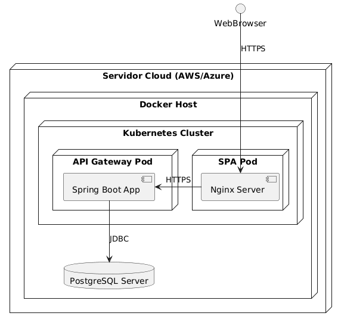

# 7. Vista de Despliegue

## Descripción

El despliegue del sistema se realizará utilizando **contenedores Docker** orquestados con **Kubernetes**. El sistema se ejecutará en un servidor en la nube (AWS/Azure).

### Infraestructura

- **Servidor Cloud (AWS/Azure)**: Proporciona la infraestructura física o virtual.
- **Docker Host**: Contenedores para los servicios backend (API Gateway) y frontend (SPA).
- **Kubernetes Cluster**: Orquesta los contenedores y maneja el escalado.

## Diagrama de Despliegue

